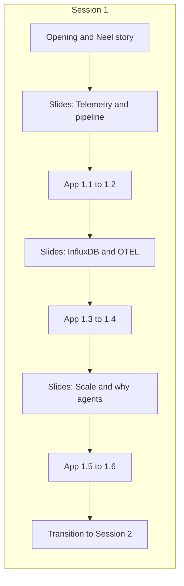
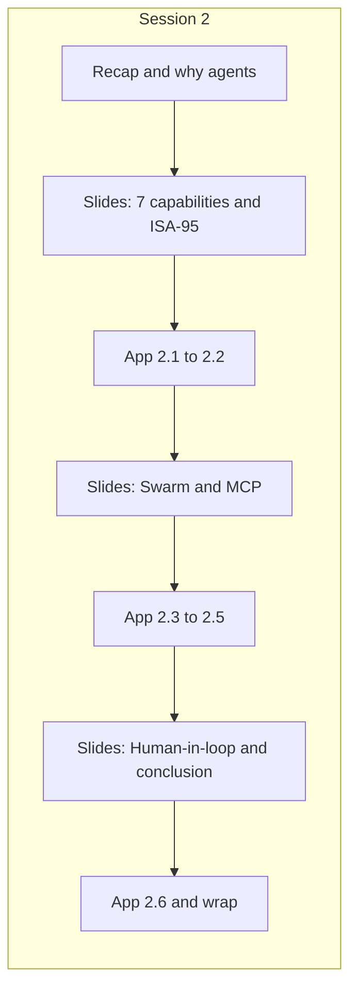

# Trainer Reference: Plan, Flow, and Timing

**Ghost in the Machine** — FDP Workshop (MSRIT)

This document gives facilitators a **time-bounded plan and flow** for both sessions. Use it alongside the **session reference** docs (content and slides) and the **workshop app** (exercises and timers).

---

## 1. Purpose and How to Use This Doc

### What This Doc Is

- **Plan**: In what order to do slides vs app, and how long each block should take.
- **Flow**: When to present (slides) vs when to switch to the app (exercises).
- **Timing**: Suggested durations per block; where to add buffer or cut if behind/ahead.

### What This Doc Is Not

- It does **not** replace [session-1-reference.md](session-1-reference.md) or [session-2-reference.md](session-2-reference.md)—those are the source for *content* and slide structure.
- It does **not** change the app; it only *references* existing time limits and exercise order.
- It does **not** duplicate full slide text or rubrics; it points to "Session 1 reference, slides 4–5" and "App: Session 1 → Exercise 1.1 (5 min)."

### How to Use It

1. **Before the workshop**: Read Session 1 and Session 2 sections; note the quick-reference table and flow diagrams.
2. **In the room**: Use the table to announce blocks ("Next: slides 4–5, then App 1.1 — 5 minutes") and the app timer for exercise duration.
3. **If behind**: Use the "Cut if behind" tips to shorten slides or combine blocks.
4. **If ahead**: Use the "Extend if ahead" tips (debrief, Bonus, discussion).

---

## 2. Quick-Reference Timing Table

All exercise durations come from the **app** ([app/lib/exercises/session1/index.ts](../../../../../app/lib/exercises/session1/index.ts), [session2/index.ts](../../../../../app/lib/exercises/session2/index.ts)). "Suggested block" includes a short slide intro and/or debrief where applicable.

| Session | Block | App exercise | App time limit | Base pts | Suggested block (slide + app + debrief) |
|---------|-------|--------------|----------------|----------|----------------------------------------|
| **1** | Opening + Neel story | — | — | — | 10–15 min |
| **1** | Slides 4–5 → App 1.1 | 1.1 Telemetry Fundamentals | 5 min | 50 | ~8 min |
| **1** | App 1.2 | 1.2 Data Challenge | 8 min | 100 | ~10 min |
| **1** | Slides 6–8 → App 1.3 | 1.3 OpenTelemetry Matching | 4 min | 50 | ~7 min |
| **1** | App 1.4 | 1.4 Pipeline Builder | 5 min | 75 | ~7 min |
| **1** | Slides 9–11, 12–13 → App 1.5 | 1.5 LLMs & AI Agents Quiz | 5 min | 50 | ~8 min |
| **1** | App 1.6 | 1.6 MCP Challenge | 6 min | 75 | ~8 min |
| **1** | Slide 16 / Transition | — | — | — | ~5 min |
| **1** | *(Optional)* Bonus | Drishti Interpretation | No limit | 100 | As time allows |
| **2** | Recap + transition | — | — | — | 5–10 min |
| **2** | Slides 2–4 → App 2.1 | 2.1 Why AI Agents Quiz | 6 min | 75 | ~9 min |
| **2** | App 2.2 | 2.2 Five Demos Scenarios | 8 min | 100 | ~10 min |
| **2** | Slides 5–7, 8–10 → App 2.3 | 2.3 Threshold Tuner | 6 min | 100 | ~9 min |
| **2** | App 2.4 | 2.4 Classification Game | 10 min | 150 | ~12 min |
| **2** | App 2.5 | 2.5 Architecture Builder | 7 min | 100 | ~9 min |
| **2** | Slides 15–16, 17–18 → App 2.6 | 2.6 Final Integration | 12 min | 175 | ~18 min |
| **2** | Slide 19 / Wrap | — | — | — | ~5 min |

**Rough totals (core only, no break):**

- **Session 1**: Opening ~12 min + exercises/blocks ~53 min + transition ~5 min ≈ **70 min** (add 5–15 min buffer → 75–85 min; with break → ~90 min).
- **Session 2**: Recap ~7 min + exercises/blocks ~72 min + wrap ~5 min ≈ **84 min** (add 5–10 min buffer → 90–95 min; with break → ~2 h).

---

## 3. Session 1: Plan and Flow with Timing

### Flow Overview

### Block-by-Block (Session 1)

| Wall clock | Block | Slides (session-1-reference) | App | Debrief |
|-----------|-------|-----------------------------|-----|---------|
| 0:00 | **Opening** | Slide 1 (Title), Slides 2–3 (Neel's Story) | — | — |
| ~12 min | **Telemetry + first exercises** | Slides 4–5 (What is Telemetry?, pipeline) | 1.1 (5 min), then 1.2 (8 min) | 1–2 min after 1.2: "What did you notice in the data?" |
| ~32 min | **InfluxDB & OTEL + next exercises** | Slides 6–8 (InfluxDB & Time-Series), Slides 9–11 (OpenTelemetry) | 1.3 (4 min), then 1.4 (5 min) | Optional: quick recap of pipeline vs OTEL |
| ~50 min | **Data challenge context + agents** | Slides 12–13 (Data Challenge), Slides 14–15 (Problem Scale) | 1.5 (5 min), then 1.6 (6 min) | 1–2 min: "Why do we need agents?" |
| ~65 min | **Transition** | Slide 16 (Transition to Session 2) | — | Preview swarm (Drishti, Jibreel, Athena, Vidhaata, Hermes) |
| *If time* | **Bonus** | — | Bonus: Drishti Interpretation (no time limit) | — |

### Slide-to-Block Mapping (Session 1)

- **Slide 1**: Title — use in Opening.
- **Slides 2–3**: Neel's Story — Opening.
- **Slides 4–5**: What is Telemetry? + pipeline — before App 1.1.
- **Slides 6–8**: InfluxDB & Time-Series — before App 1.3.
- **Slides 9–11**: OpenTelemetry — after 1.2 debrief, before or alongside 1.3.
- **Slides 12–13**: The Data Challenge — before App 1.5 (sets up "why agents").
- **Slides 14–15**: The Problem Scale — before or after 1.5.
- **Slide 16**: Transition to Session 2 — after App 1.6.

### Cut If Behind (Session 1)

- **Slides 6–8**: Shorten to one slide on "why time-series DBs" and one on key concepts; skip sample Flux query or show only briefly.
- **Slides 9–11**: Cover three pillars in one slide; show OTEL architecture on one slide; skip "how it connects to industrial" or one sentence.
- **Exercises**: Run 1.3 and 1.4 back-to-back with minimal slide recap; or shorten debrief after 1.2 and 1.6.

### Extend If Ahead (Session 1)

- **After 1.2 (Data Challenge)**: Longer debrief — "Who saw harmonics? Who saw the red herring?" (add 3–5 min).
- **Bonus**: Offer Drishti Interpretation; no time limit, so participants can continue during break or after session.
- **Slide 16**: Expand preview of each agent (1 min each) to fill time.

---

## 4. Session 2: Plan and Flow with Timing

### Flow Overview

### Block-by-Block (Session 2)

| Wall clock | Block | Slides (session-2-reference) | App | Debrief |
|-----------|-------|-----------------------------|-----|---------|
| 0:00 | **Recap** | Slide 1 (Recap of Session 1) | — | — |
| ~7 min | **Why AI agents + first exercises** | Slides 2–4 (Why AI Agents?, 7 capabilities, ISA-95) | 2.1 (6 min), then 2.2 (8 min) | 1–2 min: "Which capability surprised you?" |
| ~28 min | **Swarm + MCP + next exercises** | Slides 5–7 (Meet the Swarm), Slides 8–10 (MCP Deep Dive) | 2.3 (6 min), then 2.4 (10 min), then 2.5 (7 min) | Optional after 2.4: "How did you balance INFO vs WARNING?" |
| ~62 min | **Human-in-loop + final exercise** | Slides 11–12 (Threshold), Slides 13–14 (Classification), Slides 15–16 (Human-in-the-Loop), Slides 17–18 (Saving Neel) | 2.6 (12 min) | — |
| ~85 min | **Wrap** | Slide 19 (Call to Action) | — | Q&A, next steps |

### Slide-to-Block Mapping (Session 2)

- **Slide 1**: Recap of Session 1 — Opening.
- **Slides 2–4**: Why AI Agents? (7 capabilities, ISA-95) — before App 2.1.
- **Slides 5–7**: Meet the Swarm — before App 2.3 (or weave before 2.5 Architecture Builder).
- **Slides 8–10**: MCP Deep Dive — before or during 2.3–2.5 block.
- **Slides 11–12**: Threshold Exercise — can be brief "context" before 2.3 if not already covered.
- **Slides 13–14**: Classification Game — context before or after 2.4.
- **Slides 15–16**: Human-in-the-Loop — before App 2.6.
- **Slides 17–18**: Saving Neel — before or after 2.6; ideal before 2.6 to set stakes.
- **Slide 19**: Call to Action — after 2.6, wrap.

### Cut If Behind (Session 2)

- **Slides 8–10 (MCP)**: One slide on "What is MCP" + one on tool definition; skip connection diagram or show only.
- **Slides 11–12, 13–14**: Skip or reduce to one slide total ("threshold and classification in the app").
- **Debriefs**: Shorten or drop after 2.2 and 2.4.

### Extend If Ahead (Session 2)

- **Threshold Tuner (2.3)**: Discuss optimal settings and false positives (add 3–5 min).
- **Classification Game (2.4)**: Discuss edge cases (INFO vs WARNING) with the group.
- **Slides 17–18**: Deeper "Saving Neel" discussion — alternative timeline and mission.

---

## 5. Time Management in the Room

### Using the App Timer

- Participants see the **countdown** when an exercise is active. Announce at the start: "Opening the app for Exercise 1.2 — you have 8 minutes."
- The app enforces the limit; when time is up, submissions are final. Tell participants they can **retry later** (scores can be improved on retake, per app behavior).
- For **Bonus (Drishti Interpretation)** there is no timer; use as filler or post-session.

### Buffers

- **Session 1**: Add 5–10 min after the "InfluxDB & OTEL" block (e.g. after 1.4) for a short break; add 5 min before Slide 16 for Q&A.
- **Session 2**: Add 5–10 min after 2.2 or after 2.5 for a short break; add 5 min at the end for Slide 19 and Q&A.
- **Target session length**: 90 min per session (with one short break) or 2 h (with break + buffer). Use the quick-reference table to decide where to trim or extend.

### If Most Finish Early

- **Option A**: Short debrief — "What was hardest? What would you tune?"
- **Option B**: Preview the next exercise (one slide or one sentence).
- **Option C**: Start the next block a few minutes early and use saved time later for break or wrap.

### If Many Are Overtime

- **Per exercise**: The app will end the attempt at the time limit; tell the room "Time's up — you can retry this exercise later to improve your score."
- **Per block**: Skip the next debrief or shorten the next slide set (see "Cut if behind").
- **Session end**: Prioritize App 2.6 (Final Integration) and Slide 19 (Call to Action); trim Slides 15–18 if necessary to reach wrap on time.

---

## 6. Flow Diagrams (Summary)

**Session 1**: Opening and Neel story → Slides (Telemetry, pipeline) → App 1.1–1.2 → Slides (InfluxDB, OTEL) → App 1.3–1.4 → Slides (Scale, why agents) → App 1.5–1.6 → Transition to Session 2.

**Session 2**: Recap → Slides (Why AI agents, ISA-95) → App 2.1–2.2 → Slides (Swarm, MCP) → App 2.3–2.5 → Slides (Human-in-loop, Saving Neel) → App 2.6 → Call to Action.

Use the diagrams in sections 3 and 4 for at-a-glance flow when switching between slides and app.

---

## 7. Acronyms Used in This Project

All acronyms used across the workshop (Session 1 and Session 2 references and this trainer doc):

| Acronym | Expansion |
|---------|-----------|
| **API** | Application Programming Interface |
| **CMMS** | Computerized Maintenance Management System |
| **CRUD** | Create, Read, Update, Delete |
| **DCS** | Distributed Control System |
| **ERP** | Enterprise Resource Planning |
| **FDP** | Faculty Development Programme |
| **HMI** | Human-Machine Interface |
| **HTTP** | Hypertext Transfer Protocol |
| **ISA-95** | International Society of Automation Standard 95 (Enterprise–Control System Integration) |
| **JSON-RPC** | JSON Remote Procedure Call |
| **LLM** | Large Language Model |
| **MCP** | Model Context Protocol |
| **MES** | Manufacturing Execution System |
| **MQTT** | Message Queuing Telemetry Transport |
| **MTBF** | Mean Time Between Failures |
| **OPC-UA** | OPC Unified Architecture (industrial communication protocol) |
| **OTEL** | OpenTelemetry |
| **PLC** | Programmable Logic Controller |
| **QMS** | Quality Management System |
| **ROI** | Return on Investment |
| **SCADA** | Supervisory Control and Data Acquisition |
| **SDK** | Software Development Kit |
| **SLA** | Service Level Agreement |

*Sources: [session-1-reference.md](session-1-reference.md), [session-2-reference.md](session-2-reference.md), and this document.*

---

*Trainer Reference for FDP Workshop: Ghost in the Machine*  
*Version: 1.0 | Date: February 2025*
